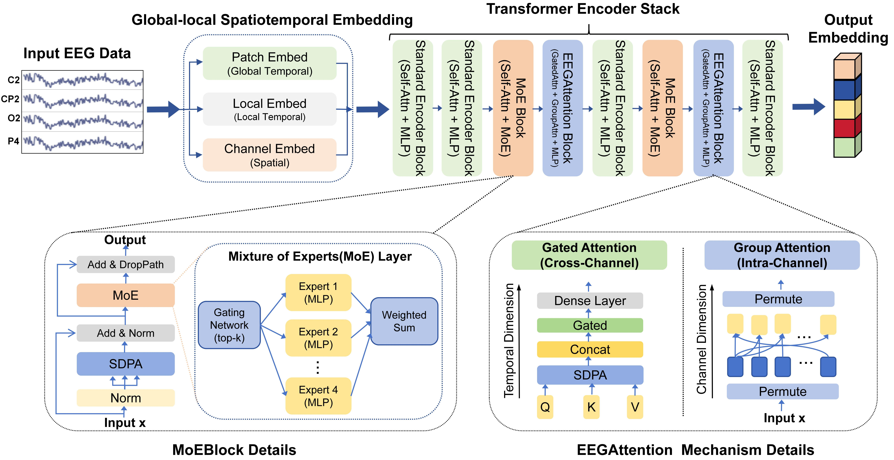
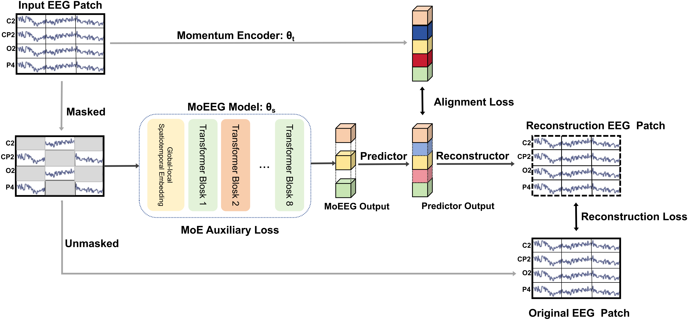

2026/8/3 Updata:
https://escholarship.org/uc/item/7wd8s47n

----------------------------------------------------------------------------------------------------------------
2026/4/8 Updata:
Our work has been accepted as a full paper at CogSci 2026 and will be presented upon proceedings publication.

----------------------------------------------------------------------------------------------------------------

**MoEEG: A Sparse Mixture-of-Experts Transformer for Universal EEG Representation Learning**

This repository is the official implementation of **MoEEG: A Sparse Mixture-of-Experts Transformer for Universal EEG**

**Representation Learning**



MoEEG has two variants,  Base and Large, which share an identical model architecture but differ in hyperparameter configurations: the Base model features an embedding dimension of 128 with 4 attention heads, while the Large model features an embedding dimension of 512 with 8 attention heads. Specifically, MoEEG-Large scales to 40M parameters  to capture high-dimensional neural dynamics. 

For pre-training, we adopted 16-bit mixed precision on an RTX 4060 (8G) GPU, with optimization implemented via the AdamW optimizer and OneCycleLR scheduler (learning rate = 6 × 10⁻⁵) to ensure stable convergence. To evaluate the generalizability of learned features, linear probing was employed under a Leave-One-Subject-Out (LOSO) cross-validation scheme on downstream tasks.

## Requirements

To install requirements:

```bash
pip install -r requirements.txt
```


## Datasets

Follow the instructions in the [datasets/pretrain/readme.md](Datasets/pretrain/readme.md) to download the pre-training EEG dataset.

```bash
cd Datasets/pretrain
```
Note: If the script encounters an error when running, you can try running it again.

In the pre-training phase, the input signals are standardized into EEG signals of size [58, 1024] to formalize the pre-training process. For downstream tasks, the original number of channels of the signals is retained.

## Pretrained Models

You can get pretrained models here:

- [MoEEG_base](checkpoint/MoEEG_base.ckpt)  : trained on mixed dataset (58-channels, 256Hz, 4s time length EEG) using patch size 16. 

For downstream tasks, you should place it into `checkpoint` folder as file name "checkpoint/MoEEG_base.ckpt". 

Other pretrained models:

- [BIOT](https://github.com/ycq091044/BIOT/tree/main/pretrained-models) should be placed into `Downstream/Task/Modules/BIOT/EEG-PREST-16-channels.ckpt`,`downstream/Modules/BIOT/EEG-SHHS+PREST-18-channels.ckpt`,`downstream/Modules/BIOT/EEG-six-datasets-18-channels.ckpt`.
- [LaBraM](https://github.com/935963004/LaBraM) should be placed into `Downstream/Task/Modules/LaBraM/labram-base.pth`.
- [EEGPT](https://github.com/BINE022/EEGPT.git) should be placed into `Downstream/Task/Modules/EEGPT/eegpt_mcae_58chs_4s_large4E.ckpt`.



## Pre-training

To pretrain the model(s) in the paper, configure the `Pretraining/configs.py` and run this command:

```bash
cd Pretraining
python run_pretraining.py
```

## Downstream Tasks

To perform downstream tasks, first navigate to the **Datasets/Downstream** folder and process the downstream task data in accordance with the instructions in the [readme](Datasets/downstream/readme.md) file.
configure the python scripts in the `Downstream` folder and run this command:

```bash
cd Downstream/Task/
python {model}_{task}.py
```
